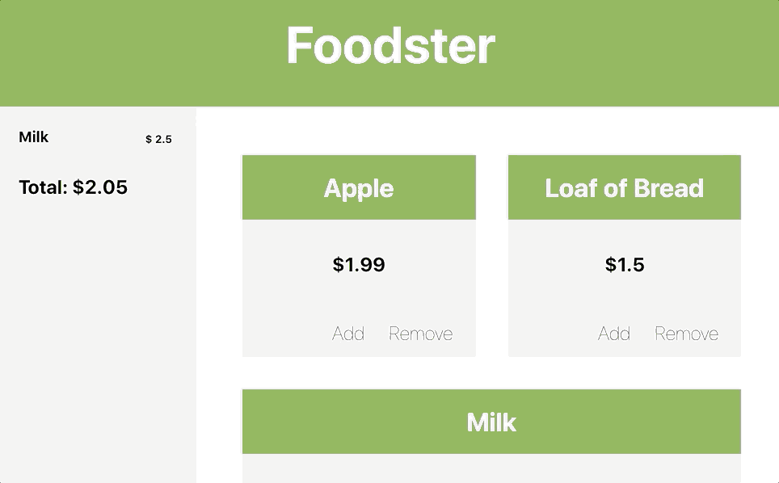

# Create A Grocery App

## The Goal
In this lab, you're going to build the front-end for a digital grocery store! Users will be able to add and remove items to and from their cart and see a live total updated as they make changes.

## Getting Started

1. Clone this repository using `git clone`
2. `cd` into the project folder
3. `npm install`
4. `npm start`

## The Lab
### Part One: Display the Items
Before starting, look at the `App.js` file, and pay special attention to the components used - looks like it only has three: `<Hero />`, `<ProductList />`, and `<ShoppingCart />`. However, you'll notice that there's also another component in the `components` folder called `product.js`. That component will be used not as a child component of the `App`, but as its grandchild component instead. So for this first bit we'll be developing mostly in the `productList.js` file, where we can insert some `<Product />` components, and in the `product.js` file, where we can make that product more responsive.

###### Core features:
1. In `productList.js`, Replace the placeholder text with at least one `<Product />` component.
2. The `ProductList` component has a prop called `inventory`, which is an array of food objects. Pass the first string in that array down to the first `<Product />` component as a prop (called something like `name`), and then go display the product name as part of the `Product` component in the `product.js` file.
3. Using a similar strategy as in step 2, try to display that price on the product.
4. Complete this for all three of the products in our starting inventory.

###### Stretch features:
* Doing this manually is pretty tedious, and would be impossible if we had 100 or so items. Use a `.map()` method to display all the items instead.

### Part Two: Create the add-remove functions
Since the state is maintained in the `App` component, you'll need to create the state-modifying functions `addToShoppingCart` and `removeFromShoppingCart` at that level and pass them down to the child components. The `addToShoppingCart` function has already been created for you, but the remove function hasn't, and it's actually a little tougher - make sure to look up a refresher on how to remove items from a JavaScript array before implementing it.

###### Core features:
1. Pass the `addToShoppingCart` function to the `ProductList` component, and then down again to each `Product` component. It's probably a good idea to use the React inspector to make sure the function is in each `Product` component's props before going much further.
2. Modify the `onClick` of the "add" button in the `Product` component so that the onClick event calls the function you passed down as a prop in step 1 (instead of just console logging a string like it currently does). If it works, the "add" button will add that product to your shopping cart. Use the React inspector to see if the `App` component's state is updating as intended when you click an add button.
3. Build out a `removeFromShoppingCart` function.
4. Pass that function down as a prop to the `Product` component.
5. Modify the `Product` component so that the remove button removes said item from the cart. Bear in mind that since the state isn't displayed anywhere, you'll want to use the React inspector to confirm that this is working.

###### Stretch features:
* The cart can get pretty disorganized as it stands now. Modify the add function to insert the items alphabetically instead of just appending to the end.

### Part Three: Build the shopping cart display
Now that state is updating, we need to get the contents on screen. Remember that if you try directly accessing items in the cart with numerical indexes (like `cart[0]`), you'll get errors if you try to access items that aren't there. So the first thing we'll do is build an if statement so that it only starts accessing the cart if there are items in the cart.

###### Core features:
1. Pass both parts of the `App` component's state (the `cart` and the `total`) to the `ShoppingCart` component.
2. Now that the total is a prop of the `ShoppingCart` component, display that total where the hard-coded placeholder `120` is listed.
3. Write an if statement that checks to see if your cart has at least one item in it. If not, display a message like `your cart is empty :(`.
4. If `cart[0]` exists, display it.
5. Add the `priceList` as a prop, and then display the price of the first item in your cart.
6. Convert your hardcoded `cart[0]` into a more flexible `.map()` method to create each item.

###### Stretch features:
* Right now, you are probably seeing unusual price formats like $3.5 instead of $3.50, and you may get some rounding errors in JavaScript that will lead to even wackier issues like $1.989999999999 (instead of $1.99). Consider creating a `PriceFormatter` function to convert a number into a string that always has exactly two digits after the decimal point.

## Extensions
(These don't really have to be done in a certain order).
* Most shopping carts have the option for you to click a little `x` next to the item to remove it from your cart. See if you can figure out how to do that.
* Our shopping cart is really disorganized and really inefficient. Most users would expect something more like `Apples, 2 @ $1.99: $3.98` instead of listing each as a separate line item. This can be achieved by either creating a more dynamic cart structure behind the scenes (in state), or by writing some helper functions in the `ShoppingCart` component.
* Since `ProductList` basically has only one job - to render out all the `Product` components, both are probably unnecessary. Abstract one away and use a `.map()` method to render all the products instead.
* Right now our inventory says which items we have for sale, but doesn't keep track of quantities, so if a user ordered more apples than we have in stock, we'd be unable to fulfill the order. Figure out how we can handle that.
